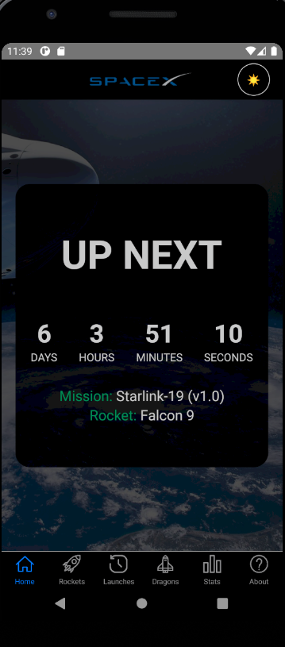
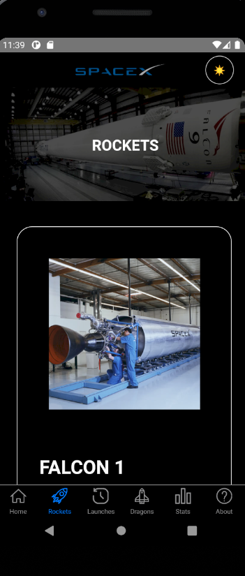
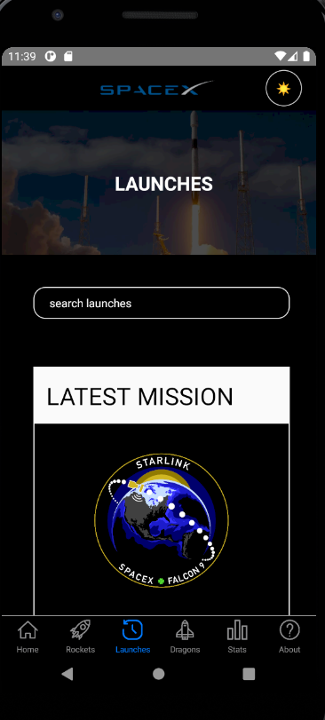
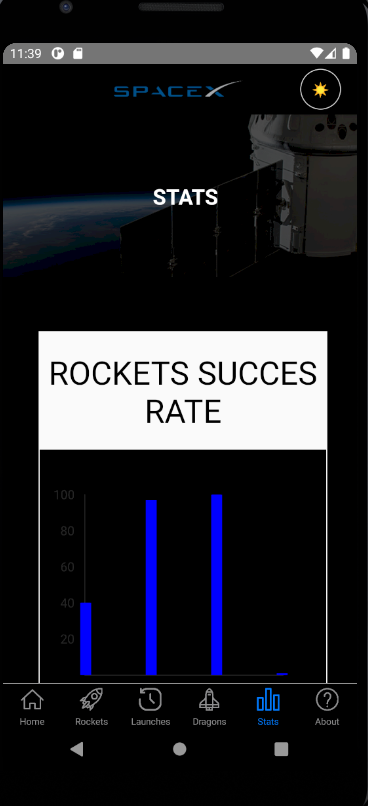
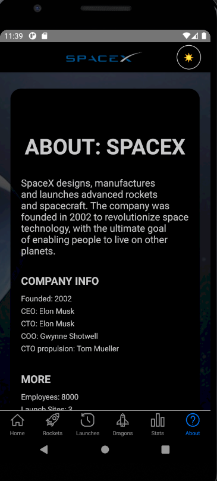

<h1 align="center">
   Stats-SpaceX-app 
</h1>

Stats-SpaceX-app is a mobile app developed with React-native and the <a href="https://github.com/r-spacex/SpaceX-API">Space X API</a> 

> Download Apk:   

## Table of Contents
- [Steps to Collaborate](#steps-to-collaborate)
- [Views](#views)
  - [Home](#home)
  - [Rockets](#Rockets)
  - [Dragons](#Dragons)
  - [Launches](#Launches)
  - [About](#About)
- [More Information](#more-information)
- [License](#license)

## Steps to Collaborate

1. Fork the project: by clicking the fork button (located at the top right corner)
2. Clone the project: `git clone https://github.com/<your username>/Stats-SpaceX-app`
3. Install dependencies: `npm install` or use `npm i`
4. Run the project: `npx react-native start`
5. Do the necessary improvements and make a commit: `git commit -am "<commit message>"` or use `git add .` and then `git commit -m "<commit message>"`
6. Upload changes to the repository created with the fork: `git push origin <branch name>`
7. Create a pull request to the original project.

## Views

### Home/count-down 

    

### Rockets view

    

### Dragons view

    

### Launches view

    

### stats view

    

### About view

    

## More Information

This project was make with React-native, Styled components, victory-native and Api Rest services.

## License

[MIT License](https://github.com/Ulzahk/Frontend-Blog/blob/main/LICENSE)